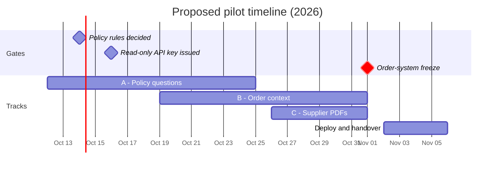

# CommerceOps Copilot — Discovery Summary

*Last updated: 6 Oct 2026 · Author: Ozan Alpkaya*

## Context

Lumora Home wants AI help for its customer support team before Black Friday (27 Nov 2026). This summary records what discovery found and proposes a 4-week pilot. The written proposal goes to Selin Aydin by Oct 9, 2026.

- **5 Oct:** kickoff with Selin Aydin, Customer Operations Director
- **6 Oct:** working session with Burak Demir (Support Team Lead) and Emre Kaya (IT Lead)

## Problem

Return questions are slow and answered inconsistently, and part of the inconsistency comes from the policy itself, not the agents.

- **Speed.** A return ticket takes 11–12 minutes because agents check four sources: the admin panel, the carrier portal, a 40-page policy PDF and a Slack exceptions channel.
- **Inconsistency.** Two agents can give opposite answers to the same question. Three return rules are ambiguous or undocumented (see Policy decisions needed), so no tool can answer them consistently until they are decided.
- **Catalog errors.** Supplier PDFs are keyed in by hand. Errors reach product pages and come back as support tickets.

## Key numbers

Returns are 40% of ticket volume and the slowest ticket type, so the pilot targets them first.

| Metric | Value |
| --- | --- |
| Weekly tickets | \~3,500 (Black Friday week: 9,000–10,000) |
| Support team | 25 agents |
| Channels | Email and live chat in Zendesk; phone negligible |
| Ticket mix | Returns/exchanges 40%, order status 25%, product questions 15%, other 20% |
| Average handle time | Returns 11–12 min, order status 4 min, product questions 6 min |
| First response time | Target 24 h; current \~30 h; last Black Friday 72 h |
| New-agent ramp-up on returns | \~6 weeks |
| Catalog intake | 4 people, \~120 suppliers, \~200 PDFs/month, 2 days per batch |

Sources: Selin Aydin and Burak Demir; handle times from Zendesk reports.

## Users

Support agents are the primary users; the team lead and the catalog team are secondary. Some agents fear replacement, so pilot agents help shape the tool through weekly feedback.

| User | Need | Role in pilot |
| --- | --- | --- |
| Support agents (25; 3–4 in pilot) | Correct, cited answers and order context in one place | Primary users; weekly feedback |
| Support team lead (Burak Demir) | Fewer escalations, faster onboarding | Picks pilot agents, grades answers, administers Zendesk |
| Catalog team (4 people) | Product data pulled from supplier PDFs | Reviews extracted data in week 3 |

## Policy decisions needed

Three return rules need a decision from the policy owner before Copilot answers them. Until then, Copilot flags these cases to the team lead instead of guessing.

| # | Question | Current practice |
| --- | --- | --- |
| 1 | Does the return window start at order date or delivery date? | Policy says order date since March; about half the team uses delivery date |
| 2 | What counts as a campaign item (exchange only, no return)? | Undefined: outlet items or coupon orders, decided by each agent |
| 3 | Is the opened-packaging rule for hygiene items waived when the item is defective? | Exception exists only in Slack, not in the policy |

Two policy versions also apply (before and after March), chosen by order date. Proposed owner: Selin Aydin, with legal review where needed; decisions requested by 14 Oct.

## Constraints

The order-system freeze and the legal review for customer data shape the pilot: read-only access requested in October, and no customer data sent to a new provider without legal approval.

- **Order API.** In-house REST/JSON API, also used by the mobile app; the OpenAPI spec is partly outdated. One API key per client, 100 requests/min per key. Read endpoints: orders, customers, products, shipments, returns. One write endpoint: create return.
- **Change freeze, 1 Nov – 5 Dec.** No deploys, config changes or new integrations on the order system. New API keys can only be issued in October.
- **IT capacity.** A few hours per week from Emre Kaya.
- **Data and legal.** Customer data lives in AWS eu-central-1 (Frankfurt). A new third-party data processor needs fresh legal approval, which can take several weeks.
- **Zendesk.** Suite Professional with API access, administered by the support team; no custom apps today.

## Proposed pilot

A 4-week, read-only pilot from 12 Oct to 6 Nov, in three tracks ordered so that work needing no customer data starts first.

- **Track A — Policy questions (weeks 1–2).** Cited answers from the policy PDF and the Slack exceptions. Uses no customer data, so it has no legal dependency.
- **Track B — Order context (weeks 2–3).** Read-only lookups of orders, shipments and returns. Return eligibility comes from deterministic rules, not the model. Copilot drafts the return; the agent submits it in the admin panel.
- **Track C — Supplier PDF extraction (week 3).** Structured product data for catalog review. Uses no customer data.
- **Week 4 — Deploy and handover.** Runs in Lumora's AWS account with company SSO and monitoring. Ends with a results summary Selin Aydin can take to the board.

Models run on Amazon Bedrock in eu-central-1, so customer data stays in Lumora's AWS account (pending legal confirmation). Pilot agents use a standalone web app.

The API key and the policy decisions gate Track B; the pilot ends three weeks before Black Friday.

## Success metrics

The pilot succeeds if Copilot answers return questions correctly and consistently and cuts handle time for pilot agents. Team-wide first response time is the rollout goal, not a pilot metric: 3–4 agents cannot move it.

| Metric | Baseline | Pilot target | How measured |
| --- | --- | --- | --- |
| Answer accuracy on return and policy questions | Unknown; team lead grades 50 closed tickets in week 1 | ≥ 90% correct with a valid policy citation | 100-question test set built with Burak Demir |
| Consistency | Opposite answers to the same question occur | Same decision on 100% of paraphrased variants | Paraphrase groups in the test set |
| Undecided policy cases | Agents guess | 0 confident answers; every case flagged | Test set covers all three open rules |
| Return handle time, pilot agents | 11–12 min | ≤ 7 min | Zendesk reports, pilot vs. non-pilot agents |
| Adoption | None today | Used on ≥ 70% of eligible pilot tickets | Copilot usage logs |
| Catalog extraction accuracy | Manual entry, 2 days per batch | ≥ 95% of fields correct | Labeled sample of supplier PDFs, checked by the catalog team |

## Out of scope

The pilot assists agents only; it does not talk to customers or change any Lumora system.

- Customer-facing chatbot or automatic replies
- Creating returns or refunds through the API; write access is reviewed after 5 Dec, following a security review and a staging test
- Any change to the order system
- Deciding policy: Lumora owns the rules, Copilot applies them
- Writing extracted product data into the catalog system; the catalog team reviews it instead
- Zendesk app integration; the pilot uses a standalone web app
- Multilingual support

## Risks and next steps

The pilot can start on 12 Oct if the read-only API key is issued in October and the three policy rules are decided by mid-October.

| Risk | Impact | Mitigation |
| --- | --- | --- |
| API key not issued before the 1 Nov freeze | No order context until after 5 Dec | Request the read-only key this week |
| Policy rules not decided | Accuracy and consistency targets fail for those cases | Copilot flags them; decisions tracked as a pilot dependency |
| Legal approval for customer data takes weeks | Order-context track slips | Run models inside Lumora's AWS account; start with policy Q&A, which uses no customer data |
| Outdated OpenAPI spec | Integration rework | Check every endpoint against live responses in week 1 |
| Agent distrust | Low adoption | Pilot agents chosen by Burak Demir; weekly feedback sessions |

- [ ] Ozan: send Emre Kaya the access request (read-only scope, IP allowlist) by 8 Oct
- [ ] Ozan: send the pilot proposal to Selin Aydin by 9 Oct
- [ ] Emre Kaya: issue the read-only API key; confirm staging environment, SSO provider and hosting in Lumora's AWS account
- [ ] Burak Demir: send the Zendesk macro list, 50 anonymized tickets and the names of 3–4 pilot agents; grade the baseline sample
- [ ] Selin Aydin: decide the three policy rules; confirm the pilot start
- [ ] Legal (Deniz): confirm that model processing inside Lumora's existing AWS account needs no new approval
